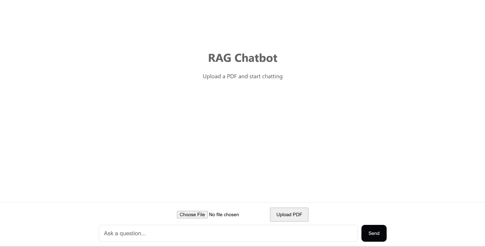
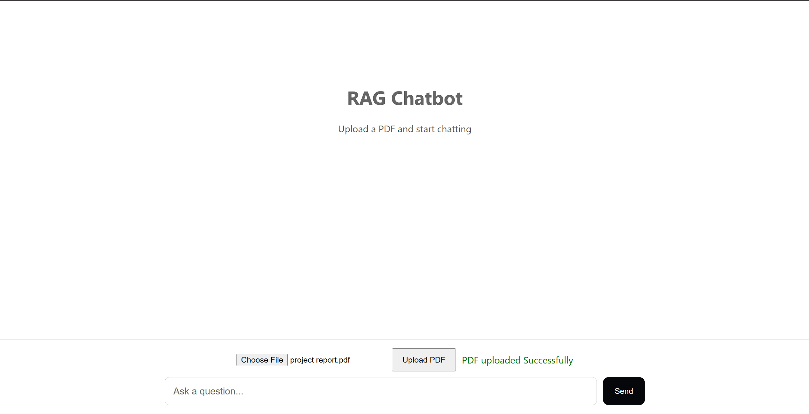
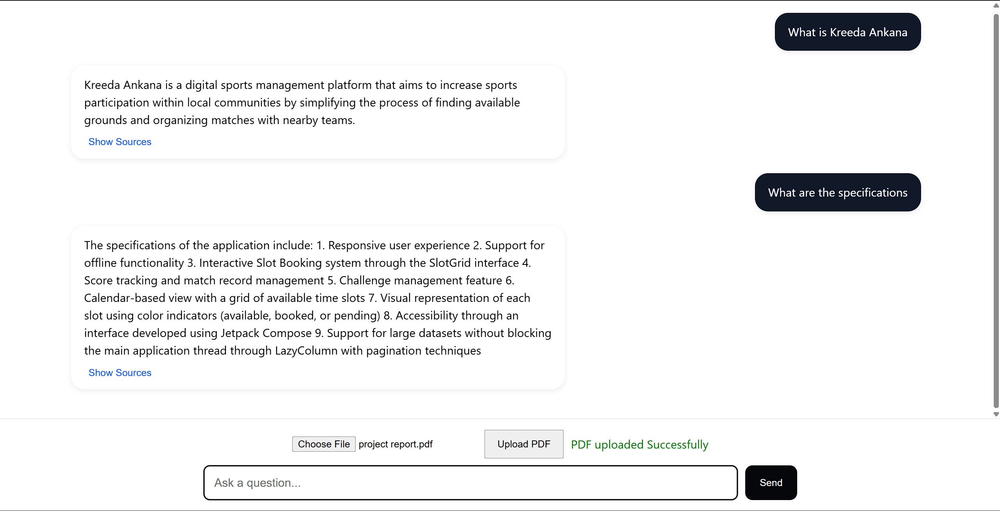

#  RAG Chatbot for PDF Question Answering

A Retrieval-Augmented Generation (RAG) chatbot that enables users to upload PDF documents and ask questions based on their content. The application retrieves relevant information from the uploaded document using semantic search and generates context-aware responses using a Large Language Model (LLM).

---

##  Features

* Upload PDF documents
* Extract and process PDF text
* Automatic text chunking
* Generate vector embeddings
* Store embeddings using FAISS
* Semantic similarity search
* Context-aware question answering
* Interactive chat interface
* FastAPI backend with React frontend

---

##  Tech Stack

### Frontend

* React.js

### Backend

* FastAPI
* Python

### AI & Retrieval

* LangChain
* FAISS
* Hugging Face Embeddings
* Groq API

---

##  Architecture

```text
PDF Upload
    ↓
Text Extraction
    ↓
Text Chunking
    ↓
Vector Embeddings
    ↓
FAISS Vector Store
    ↓
Similarity Search
    ↓
Groq LLM
    ↓
Answer Generation
```

---

##  Project Structure

```text
rag-chatbot/
│
├── backend/
│   ├── chatbot.py
│   ├── embeddings.py
│   ├── main.py
│   ├── pdf_loader.py
│   ├── text_splitter.py
│   └── requirements.txt
│
├── frontend/
│   ├── public/
│   ├── src/
│   ├── package.json
│   └── package-lock.json
│
├── .gitignore
└── README.md
```

---

##  Installation & Setup

### 1. Clone the Repository

```bash
git clone https://github.com/amshumanshetty/rag-chatbot.git
cd rag-chatbot
```

### 2. Backend Setup

```bash
cd backend

pip install -r requirements.txt
```

Create a `.env` file inside the backend directory:

```env
GROQ_API_KEY=your_groq_api_key
```

Start the backend server:

```bash
uvicorn main:app --reload
```

Backend runs at:

```text
http://127.0.0.1:8000
```

---

### 3. Frontend Setup

Open a new terminal:

```bash
cd frontend

npm install
npm start
```

Frontend runs at:

```text
http://localhost:3000
```

---

##  How It Works

1. Upload a PDF document.
2. The document is processed and converted into text chunks.
3. Hugging Face embeddings are generated for each chunk.
4. Embeddings are stored in a FAISS vector database.
5. User questions are converted into embeddings.
6. Similar chunks are retrieved using semantic search.
7. Retrieved context is passed to the Groq LLM.
8. The chatbot generates a context-aware answer.

---

##  Screenshots

### Home Screen



### PDF Upload



### Chat Interface



---

##  Future Improvements

* Source citation display
* Multiple PDF support
* Persistent chat history
* Cloud deployment
* User authentication

---

##  Author

**Amshuman S Shetty**

GitHub: https://github.com/amshumanshetty
